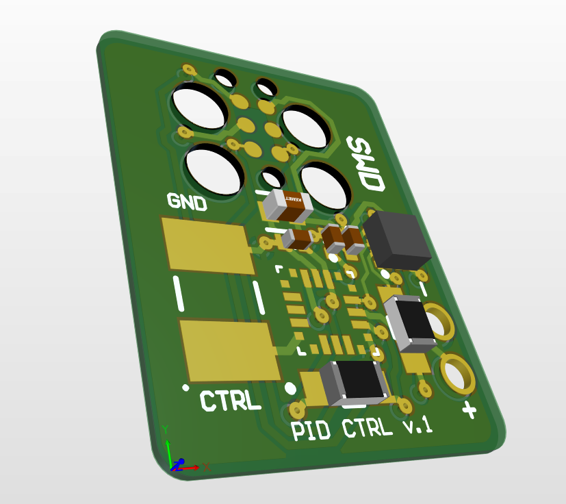
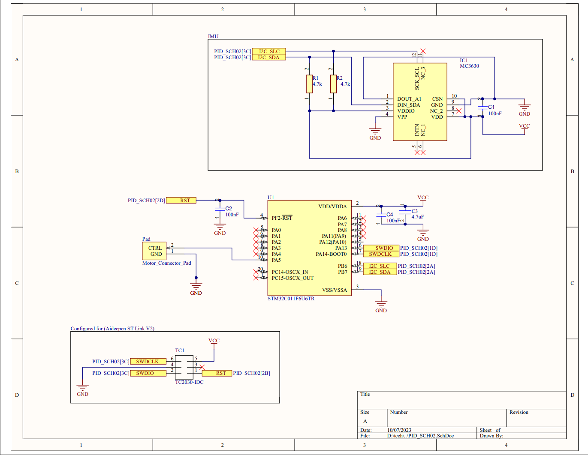

<h1 align="center">Flywheel Controller</h1>

Custom control board for reaction based flywheel controlled by PID loop function

# Overview
This small PCB runs a driver with PID loop controller for signaling a FOC controller. The FOC controller powers a brushless motor which, for this project, will mount a flywheel for reaction based stabilization. The board is programmable through the JTAG connector.

# Hardware
PCB Specs
- STM32 Microcontroller (STM32C011F6U6TR)
- Accelerometer (MC63630)
- JTAG for serial wire debug (TC2030-IDC)
- Designed in Altium

# Software
Drivers were written in C using STM32CubeIDE. The PID-Library *LINK* libarary was used in this driver.

# Project Requirements
- FOC motor controller
- Brushless motor
- Flywheel
# Description
Describe project for the eyes of a learned employer
- pictures
- wiring
- results/testing
### Schematic

# Improvements
- Status LED
- Design board with score along JTAG connector for snapping off when finished programing
- USB
